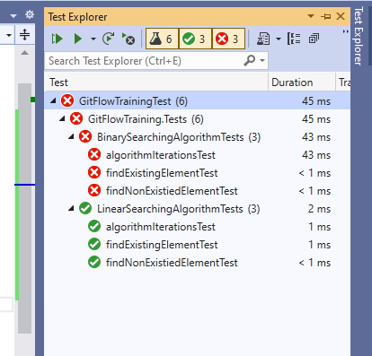
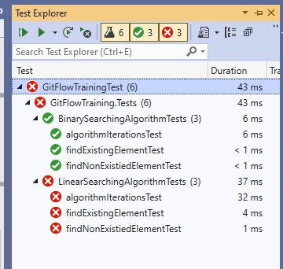

# Git Flow Training

## Main objectives for this training:

- Explain about centralized model and distributed model
  
- Explain about VCS: git, SVN(Apache Subversion)
  
- Commands: `add` & `commit` & `reset`
    - Tell about staged changes (what files and changes will be commited)
    - What will happen if I `add` a file in stage, modify it and `commit`)
    - Remove file from stage using `reset`
    - What is .gitignore file and how it can be used inside project folders

- Create, manage and remove branches
    - Tell how can work without branch
    - Demonstrate case when we can lose history

- Jumping between commits using `reset` or `checkout`
    - Tell about HEAD
    - Tell how we can lose history using `reset` 
    <br />
    
    <br />
    - Explain all `reset` flags: `--mixed`, `--soft` and `--hard`
    <br />
    
    <br />

- Explain `merge` command
<br />

<br />

- Explain `revert` command ( IMPORTANT!!! specify difference between `revert` and `reset` )
  
- (Optional) Explain `log` and flags `--all`, `--oneline` and `--graph` -> *Can be used SourceTree or VScode with GitHistory Extension* 

- (Optional) Explain `diff` command -> *Can be used SourceTree or VScode with GitLens Extension* 

### Use SSH

```bash
$ ssh-keygen -t ed25519 -C "your_email@example.com"
# specify the next path ~/.ssh/<name>
# put public key in github settings -> SSH keys

# To specify the key manually:
$ vim .git/config
# [core]
#   sshCommand = "ssh -i ~/.ssh/<name>"
#
```

### Use GPG to authorize(sign) commits

```bash
#ref: https://docs.github.com/en/authentication/managing-commit-signature-verification/generating-a-new-gpg-key

# rsa4096
$ gpg --full-generate-key
$ gpg --list-secret-keys --keyid-format=long
/Users/hubot/.gnupg/secring.gpg
------------------------------------
sec   4096R/3AA5C34371567BD2 2016-03-10 [expires: 2017-03-10]
uid                          Hubot 
ssb   4096R/42B317FD4BA89E7A 2016-03-10

$ gpg --armor --export <uid>
# Prints the GPG key ID, in ASCII armor format

# Copy your GPG key, beginning with -----BEGIN PGP PUBLIC KEY BLOCK----- and ending with -----END PGP PUBLIC KEY BLOCK-----.
# Add the GPG key to your GitHub account.

$ git config --local user.signingkey 3AA5C34371567BD2

# -S flag means signed commit
$ git commit -S -m "My commit message"

# to delete 
$ gpg --delete-secret-key 5860CC8A5984E037
```

# Technical tasks


- Clone or fork this repository and publish it to github using your account, make reporitory public
- Create branches `task1` and `task2` from the base branch `develop`
### Checkout to `task1`
- For the class `Credit` write correct logic for `Equals` and `HashCode`
- For the class `Credit` write wrong logic for `CompareTo` like
  ```cs
  //...
  return 22 + 33 - 10;
  //...
  ```
- For the class `LinearSearchingAlgorithm` write correct logic for `findElement`
- Result of tests
  <br />
  
  <br />
- Open Pull Request and notify me, I'll review it and after I approve we will merge it into `develop`, after that start working on `task2`

### Checkout to `task2`
- For the class `Credit` write correct logic for all methods (write a bit different implementation of Equals and HashCode, for example use other prime number or instead of `if` write ternary operator)
- Uncomment method `uint IterationCountForLastExecution();` from the `ISearchingAlgorithm`
- You must implement in correct way the class `BinarySearchingAlgorithm ` you can find implementation here https://github.com/IvanPostu/GitFlowTraining/pull/1/files
- To avoid compilation errors implement interface for the class `LinearSearchingAlgorithm`
```cs

// Write this inside the class LinearSearchingAlgorithm 
// to avoid compilation error on build
public uint IterationCountForLastExecution()
{
    throw new NotImplementedException();
}

```
- Uncomment Asserts from the `algorithmIterationsTest` methods from the test classes `LinearSearchingAlgorithmTests` and `BinarySearchingAlgorithmTests`
- Rebuild solution and make sure that there isn't compilation errors.
- Run all tests
  <br />
  
  <br />
- Open Pull Request and notify me, I'll review it and after we will resolve conflicts
  
### Task3
- I tell you what to do...

### Final result:
  <br />
  
  <br />
